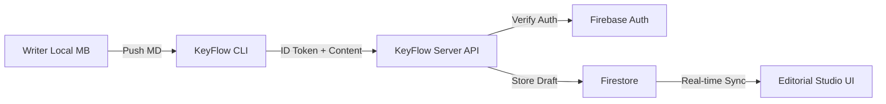

# 🦾 The Future of Editorial Collaboration: Man + Machine

The rise of agentic AI is not about replacing creators, but about augmenting our creative reach. 

## Why CLI Matters for Writers
In the modern editorial workflow, friction is the enemy of flow. By using a **CLI-first approach**, writers can:
- Stay in their favorite local environment (VS Code, Obsidian, Vim).
- Leverage AI agents to draft and refine content locally.
- Sync with a single command: `keyflow push active_draft.md`.

## Semantic Integrity
When we push a draft through the KeyFlow CLI, the server automatically:
1. Validates the author's **Firebase Identity**.
2. **Denormalizes** profile metadata for performance.
3. Prepares the content for **SEO indexing** once published.

### Architecture Diagram (Mermaid)

---
*This draft was generated to test the complete end-to-end integration of the KeyFlow ecosystem.*
